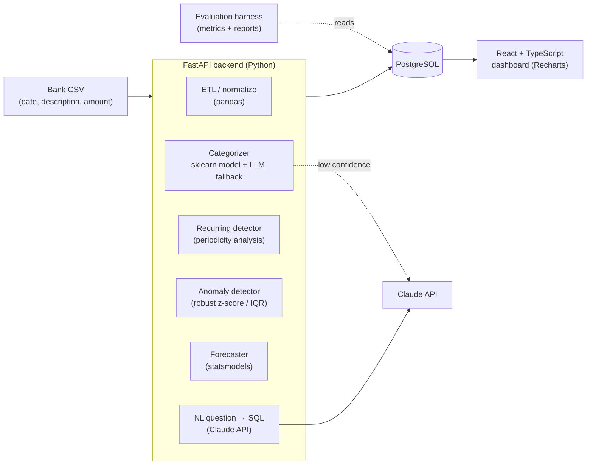

# FinScope — Personal Spending Intelligence

FinScope turns a plain bank/credit-card CSV into an honest picture of where your
money goes: it auto-categorizes every transaction, finds the subscriptions you
forgot about, flags weird charges, forecasts next month, and lets you ask
questions in plain English ("how much on coffee since June?").

It is a portfolio project that deliberately sits at the intersection of three
roles:

| Role | What this project demonstrates |
| --- | --- |
| **Software Engineer** | REST API, relational schema, migrations, auth, tests, Docker, CI/CD, typed frontend |
| **Data Analyst** | ETL pipeline, exploratory analysis, recurring-payment detection, anomaly detection, time-series forecasting, dashboards |
| **AI Engineer** | Text-classification model, LLM-assisted categorization with confidence routing, natural-language → SQL, an offline evaluation harness with metrics |

---

## The real-life problem

1. People lose an estimated 1–2 forgotten subscriptions each (~$100–300/yr) because
   statements are noisy and banks don't surface recurring charges well.
2. Budgeting apps make you categorize transactions by hand, so people stop using them.
3. "Where did my money actually go last month?" is a 20-minute spreadsheet exercise.

FinScope automates all three from a file you can already export from any bank.

## Why it stays simple

- **One input format**: a CSV with `date, description, amount`. No bank integration
  required to demo (Plaid is an optional stretch goal).
- **Synthetic data included**: `data/generate_synthetic.py` produces a realistic
  12-month statement, so the repo runs with zero real financial data and the tests
  are deterministic.
- **Three services, one `docker-compose up`**: API, Postgres, frontend.

---

## Architecture at a glance



Full detail: [docs/ARCHITECTURE.md](docs/ARCHITECTURE.md).

---

## Tech stack & why

| Layer | Choice | Reason |
| --- | --- | --- |
| Backend API | **Python 3.11 + FastAPI** | Same language as the ML/data code; async; auto OpenAPI docs |
| Data / ML | **pandas, scikit-learn, statsmodels** | Standard analyst + ML toolkit; light enough to run in CI |
| LLM | **Anthropic Claude API** (`anthropic` SDK) | Categorization fallback + natural-language→SQL |
| Database | **PostgreSQL 16** | Real SQL for the NL→SQL feature and window-function analytics |
| Migrations | **Alembic** | Versioned schema |
| Frontend | **React + TypeScript + Vite + Recharts + Tailwind** | Typed UI, fast dev server, charts without a heavy BI dep |
| Packaging | **Docker + docker-compose** | One command to run everything |
| CI | **GitHub Actions** | Lint (ruff), type-check (mypy), tests (pytest), frontend build |
| Tests | **pytest + Vitest** | Deterministic thanks to synthetic data + seeded models |

---

## Quick start

```bash
git clone <your-repo-url> finscope && cd finscope
cp .env.example .env          # add ANTHROPIC_API_KEY for LLM features (optional)
python data/generate_synthetic.py --months 12 --out data/sample_statement.csv
docker compose up --build
```

The API rebuilds the local categorizer from `data/sample_statement.labels.csv` when
that labels file is present. CI does the same before running the backend tests; the
generated model and sidecar stay uncommitted.

- API + docs: http://localhost:8000/docs
- Dashboard: http://localhost:5173

Then upload `data/sample_statement.csv` in the dashboard, or:

```bash
curl -F "file=@data/sample_statement.csv" http://localhost:8000/api/imports
```

## Run the evaluation harness

```bash
cd backend && python -m app.eval --report ../docs/eval_report.md
```

Produces categorization accuracy / macro-F1, recurring-detection precision/recall,
and NL→SQL execution accuracy against a labeled fixture set.

---

## Repo layout

```
finscope/
├── README.md
├── docs/
│   ├── PRD.md                 # product requirements & scope
│   ├── ARCHITECTURE.md        # components, data flow, decisions
│   ├── ALTERNATIVES.md        # alternate solutions reviewed + design tradeoffs
│   ├── API_SPEC.md            # exact REST contract for every endpoint
│   ├── DB_SCHEMA.md           # authoritative PostgreSQL DDL
│   ├── DATA_DICTIONARY.md     # every column explained + taxonomy
│   ├── ML.md                  # model card, features, routing logic
│   ├── EVALUATION.md          # how each ML/analytic piece is measured
│   ├── BUILD_PLAN.md          # implementation contract, milestone by milestone
│   └── ROADMAP.md             # milestones you can check off on GitHub
├── backend/
│   ├── requirements.txt
│   ├── app/
│   │   ├── main.py            # FastAPI app + routes
│   │   ├── recurring.py       # recurring-payment detection (implemented)
│   │   ├── categorize.py      # ML + LLM categorization (skeleton)
│   │   ├── anomaly.py         # anomaly detection (skeleton)
│   │   └── nlq.py             # natural-language → SQL (skeleton)
│   └── tests/
│       └── test_recurring.py
├── data/
│   └── generate_synthetic.py  # deterministic fake statement generator
├── frontend/                  # React + TS dashboard
├── docker-compose.yml
└── .github/workflows/ci.yml
```

---

## Suggested GitHub presentation

- Pin the repo; use topics: `ai-engineering`, `data-analysis`, `fastapi`, `llm`, `portfolio`.
- Put the dashboard screenshot + the mermaid diagram at the top of the README.
- Add a `docs/eval_report.md` committed from a real run so reviewers see metrics.
- Keep commits scoped to the milestones in [docs/ROADMAP.md](docs/ROADMAP.md).

## License

MIT — see `LICENSE`.
