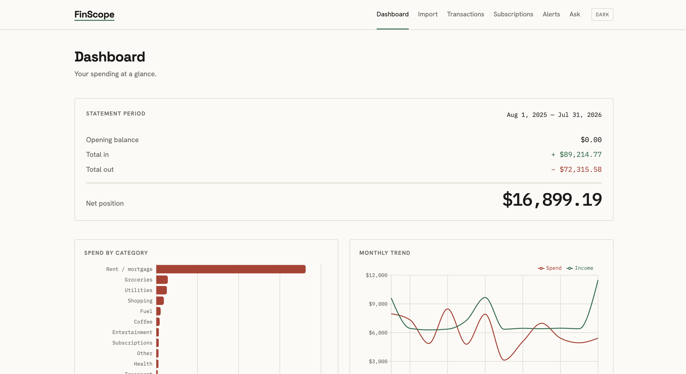
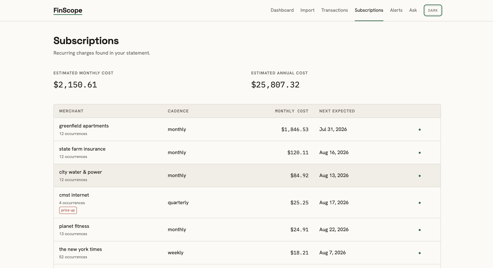
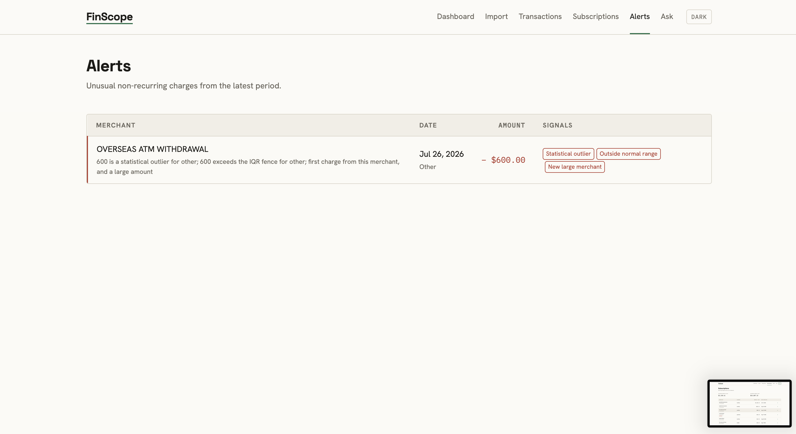
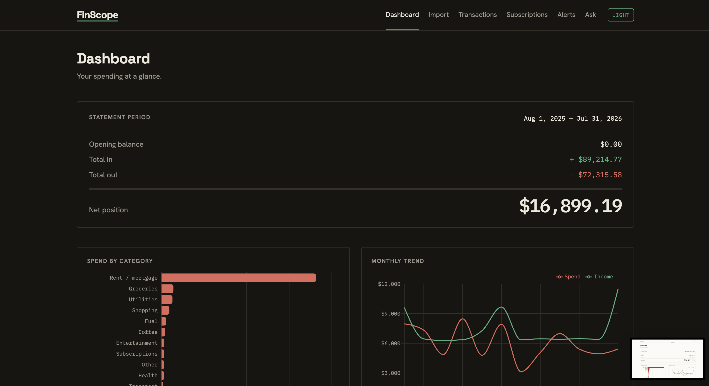
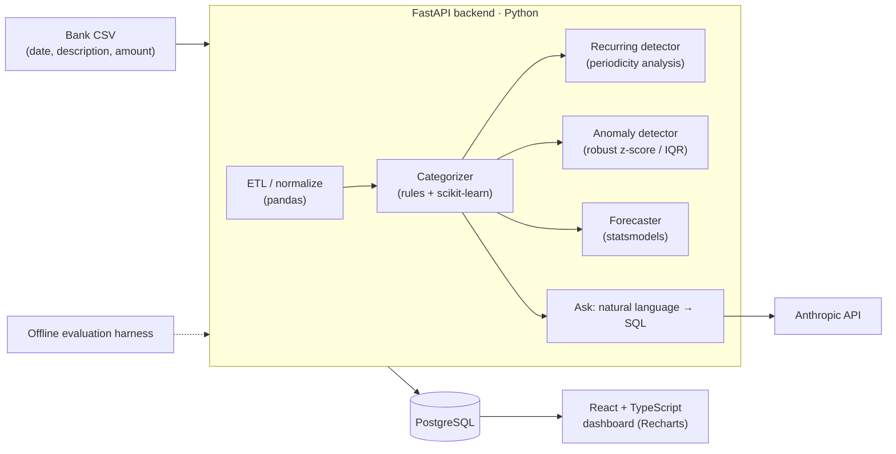

# FinScope — Personal Spending Intelligence


FinScope turns a plain bank/credit-card CSV into an honest picture of where your money goes: it auto-categorizes every transaction, finds the subscriptions you forgot about, flags weird charges, forecasts next month, and lets you ask questions in plain English ("how much on coffee since June?").

<p align="center">
  
</p>

## What it does

- Imports and categorizes transactions from a bank CSV.
- Detects recurring payments and forgotten subscriptions.
- Flags anomalous charges and unusual spending.
- Answers natural-language questions with auditable SQL.
- Forecasts next month’s spending from historical transactions.

## Three roles, one project

| Role | What this project demonstrates |
| --- | --- |
| **Software Engineer** | REST API, relational schema, migrations, tests, Docker, CI/CD, typed frontend |
| **Data Analyst** | ETL pipeline, exploratory analysis, recurring-payment detection, anomaly detection, time-series forecasting, dashboards |
| **AI Engineer** | Local text-classification model, natural-language → SQL, and an offline evaluation harness with metrics |

## The real-life problem

Bank statements are noisy: recurring charges hide in transaction lists, categories require manual cleanup, and a question like “where did my money go last month?” can become a 20-minute spreadsheet exercise. FinScope addresses those three friction points from a CSV you can export from any bank. No bank integration is required for the demo.

## Screenshots



*Subscriptions make recurring costs visible, including cadence and monthly cost.*



*Alerts surface unusual charges with the reason and transaction context.*

Ask turns a plain-English question into a read-only SQL query (shown to the user) and runs it against a restricted view — see docs/ARCHITECTURE.md for the guardrails.



*The dashboard in the dark theme.*

## Architecture



Imported rows are normalized before deterministic rules and the local model classify them; the analytical detectors and forecast remain offline, while only Ask uses the Anthropic API. FastAPI exposes the data and analysis over REST, PostgreSQL is the source of truth, and the same fixtures feed the evaluation harness. See [docs/ARCHITECTURE.md](docs/ARCHITECTURE.md) for the full design.

## Evaluation

The committed report is generated from 12 months of synthetic data, with categorizer train seed 42 and evaluation seed 7. These are the current offline results:

| Component | Metric | Result | Gate |
| --- | --- | ---: | --- |
| Categorizer | accuracy | **0.8825** | ≥ 0.84 — PASS |
| Categorizer | macro-F1 | **0.8370** | ≥ 0.78 — PASS |
| Recurring detector | precision | **0.9270** | ≥ 0.82 — PASS |
| Recurring detector | recall | **1.0000** | ≥ 0.75 — PASS |
| Anomaly detector | precision | **1.0000** | ≥ 0.7 — PASS |
| NL→SQL | valid-SQL rate | **1.0000** | ≥ 0.95 — PASS |
| NL→SQL | execution accuracy | **1.0000** | ≥ 0.8 — PASS |
| Forecaster | MAPE (3-month backtest, seasonal-naive baseline) | **58.7940** | reported |

### Categorizer routing ablation

| Configuration | Accuracy | Review rate |
| --- | ---: | ---: |
| rules-only | 0.6175 | 0.4111 |
| local-model-only | 0.8434 | 0.5798 |
| hybrid (rules + local model) | **0.8825** | **0.3675** |

The forecaster is the weakest component at 58.7940 MAPE. That number is reported, not gated; the other gated metrics must pass. CI runs the evaluation harness and fails when a gate regresses. Read the [full evaluation report](docs/eval_report.md).

## Tech stack

| Layer | Choice | Why it fits |
| --- | --- | --- |
| Backend API | Python 3.11 + FastAPI | One language for the API and data/ML code |
| Database | PostgreSQL 16 | Real SQL for analytics and Ask |
| Persistence | SQLAlchemy + Alembic | Typed models and versioned migrations |
| Data / ML | pandas + scikit-learn + statsmodels | ETL, local classification, and forecasting |
| LLM | Anthropic SDK | Powers Ask’s natural-language → SQL flow |
| Frontend | React 18 + TypeScript + Vite + Recharts + Tailwind | Typed UI and focused data visualizations |
| Runtime | Docker Compose | One command for the app, API, and database |
| CI | GitHub Actions | Lint, type-check, test, build, and eval gates |
| Tests | pytest + Vitest | Backend and frontend regression coverage |

## Quick start

```bash
git clone https://github.com/Aimanhakeemi/finscope
cd finscope
cp .env.example .env
docker compose up --build
```

`ANTHROPIC_API_KEY` is optional; only the Ask feature needs it. Open
http://localhost:5173, go to **Import**, and upload `data/sample_statement.csv`.

- App: http://localhost:5173
- API docs: http://localhost:8000/docs

## Running the tests / eval

```bash
cd backend && pytest
python -m app.eval --report ../docs/eval_report.md
```

## Repo layout

```text
finscope/
├── README.md
├── CONTRIBUTING.md
├── .github/workflows/ci.yml
├── backend/
│   └── app/
│       ├── eval.py
│       ├── routes/              # API route modules
│       └── services/            # application services
├── frontend/                    # React + TypeScript app
├── data/
│   └── sample_statement.csv     # demo upload
├── docs/
│   ├── DESIGN.md
│   ├── ARCHITECTURE.md
│   ├── eval_report.md
│   └── img/                     # README screenshots
├── docker-compose.yml
└── LICENSE
```

## Design

See [docs/DESIGN.md](docs/DESIGN.md) for FinScope’s visual system.

## License

MIT — see [LICENSE](LICENSE).
