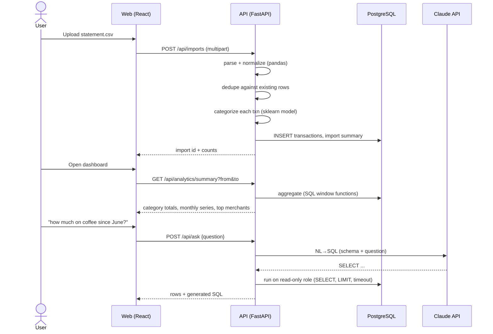

# FinScope — Architecture

## 1. Overview

Three deployable units, orchestrated by `docker-compose`:

1. **`api`** — FastAPI (Python). Owns ingestion, all analytics, and the LLM calls.
2. **`db`** — PostgreSQL 16. Source of truth; also the target of NL→SQL.
3. **`web`** — React + TypeScript SPA (Vite dev server / static build behind nginx in prod).

The API is a modular monolith: one process, but each capability
(`etl`, `categorize`, `recurring`, `anomaly`, `forecast`, `nlq`) is an
independent module with its own tests and a narrow function-level interface. This
keeps the repo readable and lets each piece be evaluated in isolation.

## 2. Data flow



## 3. Backend module responsibilities

| Module | Input | Output | Technique |
| --- | --- | --- | --- |
| `etl.py` | raw CSV bytes + column mapping | `DataFrame` of clean transactions | pandas; regex merchant cleaning; date parsing; sign normalization |
| `categorize.py` | clean transactions | category, confidence, source | TF-IDF char n-grams + `LinearSVC`/`LogisticRegression`; rules for obvious merchants; low-confidence rows surfaced for manual review |
| `recurring.py` | all transactions for a user | recurring groups (merchant, cadence, amount band, next date) | group by normalized merchant → sort dates → inter-arrival deltas → cadence match with tolerance + amount stability check |
| `anomaly.py` | transactions + category | flagged transactions with reason | per-category robust z-score (median / MAD) and IQR fence; "new large merchant" heuristic |
| `forecast.py` | monthly aggregates | next-month point + 80% interval, per category | `statsmodels` ETS / seasonal-naive baseline; fall back to trailing-median when < 6 months |
| `nlq.py` | question string | generated SQL + result rows | Claude with schema prompt; guardrail: parse to ensure single `SELECT`, inject `LIMIT`, run as `finscope_readonly` role with `statement_timeout` |

## 4. Database schema (summary)

Full column docs in [DATA_DICTIONARY.md](DATA_DICTIONARY.md).

```
users(id, email, created_at)
imports(id, user_id, filename, row_count, imported_at, date_min, date_max)
transactions(id, user_id, import_id, txn_date, description_raw, merchant,
             amount, category, category_confidence, category_source,
             is_recurring, recurring_group_id, is_anomaly, anomaly_reason,
             dedupe_key, created_at)
recurring_groups(id, user_id, merchant, cadence, avg_amount, amount_stddev,
                 first_seen, last_seen, next_expected, active)
category_corrections(id, user_id, transaction_id, old_category, new_category, created_at)
```

Analytics use SQL views:
- `v_monthly_category_spend`
- `v_merchant_totals`
- `v_readonly_transactions` (the only object exposed to NL→SQL)

## 5. Key decisions (ADR-style)

**D1 — Modular monolith, not microservices.** Portfolio scope; one language for API +
ML; simpler to run and review. Revisit only if a component needs independent scaling.

**D2 — Rules + local sklearn model for categorization; LLM reserved for NL→SQL.**
This keeps categorization deterministic, auditable, and runnable offline while
keeping the LLM use auditable and limited to the natural-language query feature.

**D3 — Rule-based recurring detection, not ML.** The signal (regular inter-arrival
times + stable amount) is explicit and explainable; an ML model here would be
harder to justify and to evaluate on small personal data.

**D4 — NL→SQL over a locked-down read-only view, not a semantic layer.** Shows real
SQL skill and a realistic security posture (least-privilege role, single-statement
parsing, timeout, row cap) without building a full BI tool.

**D5 — Synthetic data generator committed to the repo.** Makes the project runnable
and the tests deterministic without anyone sharing real financial data.

## 6. Security & privacy

- All data is per-user and local by default; no external calls except the optional
  Claude API (only transaction *descriptions* + amounts are sent, never account numbers).
- NL→SQL: dedicated `finscope_readonly` Postgres role with `SELECT` on
  `v_readonly_transactions` only; API rejects any statement that isn't a lone `SELECT`;
  `LIMIT 500` and `statement_timeout = 3s` enforced.
- Secrets via env vars; `.env` git-ignored.

## 7. Deployment

- Dev: `docker compose up` (hot reload for API and web).
- Prod (optional stretch): single VM or Fly.io/Render; `web` built to static assets,
  `api` behind uvicorn/gunicorn, managed Postgres.
- CI builds images and runs the full test + eval suite on every push.

## 8. Observability (lightweight)

- Structured JSON logs from the API.
- `/healthz` and `/metrics` (request counts and LLM call count for NL→SQL).
- The eval harness output (`docs/eval_report.md`) is the model-quality dashboard.
